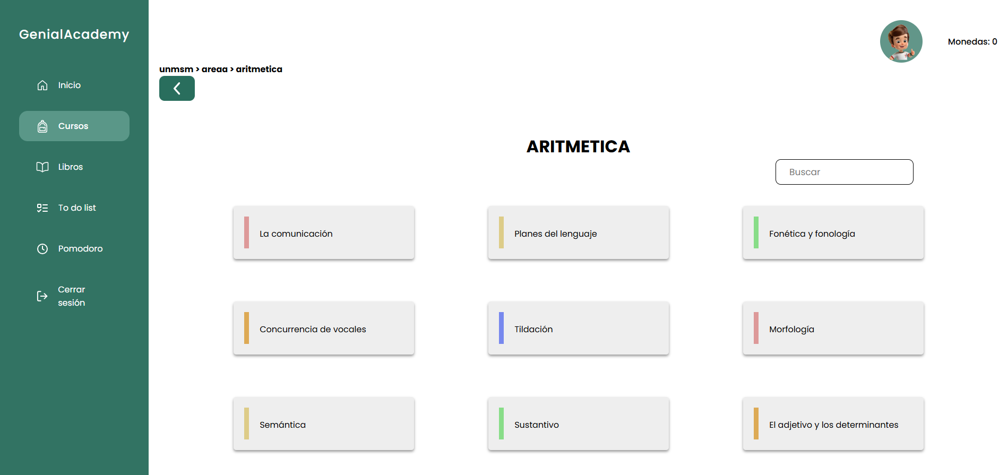
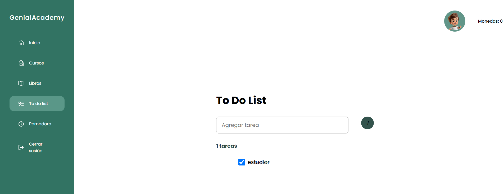

# 🚀 GENIAL ACADEMY - WEB

## 🤼‍♀️ Integrantes

- Aguilar Mata, Crisbel Leidy
- Bravo Pimentel, Rafael Alexander
- Dávila Vásquez, Rodrigo Estéfano
- Delgado de la Cruz, Valery Andrea
- Laguna Santa Cruz, Oscar Isaac
- Pariona Santiago, Joshua Bryan
- Sotelo Arce, Jocelyn Estrella

## 📋 Propósito del Proyecto
El propósito del proyecto es desarrollar una plataforma educativa web destinada a estudiantes preuniversitarios en el Perú, con el objetivo de mejorar la preparación para los exámenes de admisión a universidades. Esta plataforma proporcionará acceso equitativo a recursos educativos de alta calidad, adaptados a las necesidades y contextos específicos de los estudiantes peruanos

---
## 💻 Funcionalidades

- **Registro en la plataforma:**
Permite a los estudiantes crear una cuenta en la plataforma ingresando datos básicos como nombre completo, correo electrónico y contraseña. Este proceso puede incluir la verificación del correo electrónico para garantizar la seguridad de los usuarios.


- **Iniciar sesión mediante credenciales:** 
Los usuarios pueden acceder a la plataforma utilizando su correo electrónico y contraseña registrados. La funcionalidad incluye la opción de recuperación de contraseña en caso de olvido, y en algunos casos, autenticación mediante métodos avanzados como verificación en dos pasos


- **Búsqueda y acceso a materiales de estudio:**
Facilita a los estudiantes encontrar rápidamente recursos educativos, como preguntas de práctica y exámenes de admisión, mediante un motor de búsqueda optimizado.



- **Navegación entre cursos y biblioteca:**
Los usuarios pueden explorar un menú intuitivo que organiza los cursos disponibles y la biblioteca virtual. Ofreciendo una experiencia personalizada y eficiente.


- **Descargar materiales de estudio:**
Permite a los estudiantes descargar documentos, guías y recursos educativos en formato PDF u otros formatos compatibles, para que puedan acceder a ellos sin conexión y utilizarlos en cualquier momento.


- **To Do List:**
Ofrece a los estudiantes una herramienta para gestionar sus tareas académicas. Esta funcionalidad ayuda a mantener el seguimiento del progreso y la organización de actividades.



## 📦 Integración Continua con Jenkins

Este proyecto está configurado con Jenkins para la ejecución automática de las pruebas en cada push al repositorio. A continuación, se explica cómo se ha integrado Jenkins en el proyecto, cómo ejecuta las pruebas unitarias y funcionales, y cómo puedes ver los resultados.

### 🛠️ Requisitos Previos

1. **Jenkins** instalado y configurado.
2. **Node.js** y **npm** configurados correctamente.
3. El repositorio debe estar vinculado a Jenkins para ejecutar el pipeline de integración continua.
4. **Jenkins** instalado localmente: Versión `2.479.2`.
5. **SonarQube** instalado localmente: Versión `9.9.7.96285`.
6. Herramientas necesarias:
   - **Git** (última versión).
   - **Node.js** (última versión).
   - **Maven** (versión 3.9.9).
   - **Pruebas unitarias frontend:** Jest y React Testing Library.
   - **Pruebas funcionales frontend:** Mocha y Selenium.
   - **Pruebas funcionales backend:** Postman.
   - **Pruebas perfomance:** JMeter.
7. Sistema operativo: **Windows**.

### 📂 Configuración de Jenkins

En este proyecto, hemos configurado un **Jenkinsfile** para definir las etapas del pipeline. Las principales etapas son:

1. **Instalar dependencias**: Jenkins instalará todas las dependencias necesarias con `npm install`.
2. **Construcción del proyecto**: Jenkins compila el proyecto con `tsc` y prepara los archivos para su ejecución.
3. **Ejecutar pruebas unitarias**:
   - En esta etapa, Jenkins ejecuta las pruebas unitarias utilizando **Jest**. La configuración de las pruebas unitarias está en el archivo `package.json`, donde se encuentra el script `test:unit`, que ejecuta el comando `jest`.
4. **Ejecutar pruebas funcionales**:
   - Las pruebas funcionales se ejecutan utilizando **Newman** para correr las colecciones de Postman definidas en `docs/reports/postman/GenialAcademyBackend.postman_collection.json`.

#### Ejecutar pruebas unitarias
npm run test:unit

#### Ejecutar pruebas funcionales
npm run test:func

---

### 🔎 Utilizando herramientas para las pruebas

 - Jest y Testing react libary: Se utilizo para la pruebas unitarias del frontend
      - Evidencia de la prueba:
         ```
        test('debe cambiar el enlace activo cuando se hace clic en un enlace diferente', () => {
        render(
          <Router>
            <Aside />
          </Router>
        );
    
        // Encontramos y hacemos clic en "Cursos"
        const cursosLink = screen.getByText(/Cursos/i);
        fireEvent.click(cursosLink);
    
        // Verificamos que "Cursos" es el enlace activo
        expect(cursosLink.closest('li')).toHaveClass('active');
        
        // Aseguramos que el enlace "Inicio" ya no esté activo
        const homeLink = screen.getByText(/Inicio/i);
        expect(homeLink.closest('li')).not.toHaveClass('active');
        });
      - Evidencia integración con Jenkins:
        ```
        pipeline {
        agent any
        stages {
            stage('Instalar Dependencias') {
                steps {
                    sh 'npm install'
                }
            }
            stage('Construir Proyecto') {
                steps {
                    sh 'npm run build'
                }
            }
            stage('Ejecutar Pruebas') {
                steps {
                    sh 'npm test'
                }
            }
        }
        post {
            success {
                echo 'Pipeline ejecutado exitosamente.'
            }
            failure {
                echo 'Pipeline fallido. Revisa los errores.'
            }
          }
        }

- Selenium: Se utilizo para la pruebas funcionales del frontend
     - Evidencia de la prueba:
         ```
       def test_login_with_incorrect_username(self):
        driver = self.driver

        # Llenar el formulario con un usuario incorrecto
        username_input = driver.find_element(By.NAME, "username")
        password_input = driver.find_element(By.NAME, "password")
        submit_button = driver.find_element(By.CSS_SELECTOR, "button[type='submit']")

        username_input.send_keys("incorrect_username@domain.com")  # Usuario incorrecto
        password_input.send_keys("pistol")  # Contraseña correcta
        submit_button.click()

        # Esperar para que el sistema procese la solicitud
        time.sleep(2)

        # Verificar que aparece el modal de error
        try:
            modal_error_login = driver.find_element(By.CSS_SELECTOR, ".modal-error-login")  # Asegúrate de que la clase es          la correcta
            self.assertTrue(modal_error_login.is_displayed(), "Modal de error no aparece")
        except:
            self.fail("El modal de error no se ha mostrado correctamente")

  - Evidencia integración con Jenkins:
       ```
       pipeline {
    agent any
     stage('Run Functional Tests') {
         steps {
            script {
                sh 'newman run docs/reports/postman/GenialAcademyBackend.postman_collection.json -r htmlextra --reporter-htmlextra-export docs/reports/postman/report.html'
                    }
                }             
        }
    stages {
        stage('Instalar Dependencias') {
            steps {
                script {
                    
                    sh 'npm install'
                }
            }
        }

        stage('Ejecutar Pruebas Funcionales') {
            steps {
                script {
                    
                    sh 'npm run test:func'
                }
            }
        }
    }

    post {
        success {
            echo 'Pipeline ejecutado exitosamente.'
        }
        failure {
            echo 'Pipeline fallido. Revisa los errores.'
        }
      }
    }
- Postman: Se utilizo para la pruebas funcionales del backend
      -  Evidencia integración con Jenkins:
  
        pipeline {
        agent any
         stage('Run Functional Tests') {
             steps {
                script {
                    sh 'newman run docs/reports/postman/GenialAcademyBackend.postman_collection.json -r htmlextra --reporter-htmlextra-export docs/reports/postman/report.html'
                        }
                    }             
            }
        stages {
            stage('Instalar Dependencias') {
                steps {
                    script {
                        
                        sh 'npm install'
                    }
                }
            }
    
            stage('Ejecutar Pruebas Funcionales') {
                steps {
                    script {
                        
                        sh 'npm run test:func'
                    }
                }
            }
        }
    
        post {
            success {
                echo 'Pipeline ejecutado exitosamente.'
            }
            failure {
                echo 'Pipeline fallido. Revisa los errores.'
            }
        }
      }
## 🖥 Pruebas de Base de Datos con JMeter
### 🔧 Requisitos
1. Apache JMeter: Versión 5.5 o superior.
2. Driver JDBC de MySQL: com.mysql.jdbc.Driver.
3. Acceso a la base de datos genialacademy_db.
4. Configuración del Plan de Pruebas
### ⚙ Configuración de la Conexión JDBC
1. Nombre de la Configuración: Configuración de la Conexión JDBC.
2. Nombre de Variable Enlazado al Pool: mysql_pool.
3. Parámetros principales:
4. Máximo de conexiones: 0 (sin límite).
5. Timeout del Pool: 10,000 ms.
6. Edad máxima de las conexiones: 5,000 ms.
7. Query de validación: Activo.
8. Auto Commit: Verdadero.
### 🛠 Configuración del Grupo de Hilos
- Número de Hilos (Usuarios Virtuales): 10.
- Periodo de Subida (Ramp-Up): 1 segundo.
- Iteraciones por hilo: 10.
- Modo de usuario: "Same user on each iteration".
### 🔍 Peticiones JDBC
- select*from users;
- SELECT * FROM users WHERE id = 1;
- SELECT * FROM users WHERE district = 'Farrellfort';
- SELECT * FROM users ORDER BY created_at DESC LIMIT 10;
- SELECT COUNT(*) FROM users WHERE department = 'Arquitecto';
- UPDATE users SET district = 'SJL' WHERE province= 'North Carolina'; 
### 👀 Visualizador de resultados
Se agregaron Árboles de resultados para poder observar los resultados de los test
