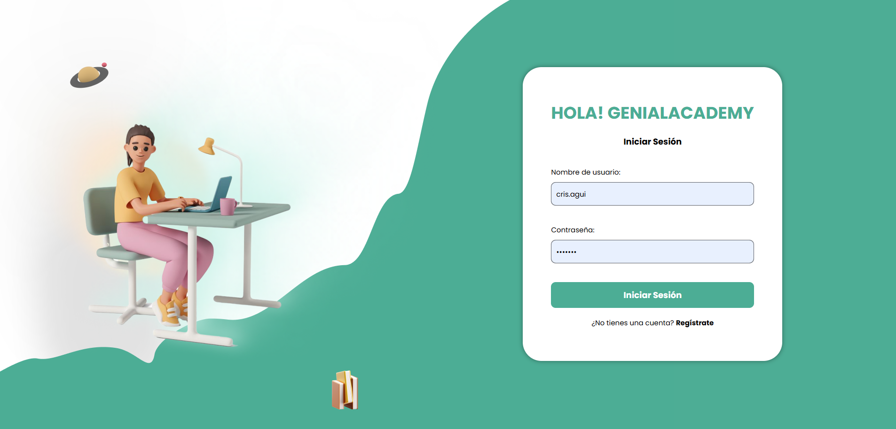

# 🚀 GENIAL ACADEMY - WEB

## 📋 Integrantes

- Aguilar Mata, Crisbel Leidy
- Bravo Pimentel, Rafael Alexander
- Dávila Vásquez, Rodrigo Estéfano
- Delgado de la Cruz, Valery Andrea
- Laguna Santa Cruz, Oscar Isaac
- Pariona Santiago, Joshua Bryan
- Sotelo Arce, Jocelyn Estrella

## 📋 Propósito del Proyecto
El propósito del proyecto es desarrollar una plataforma educativa web destinada a estudiantes preuniversitarios en el Perú, con el objetivo de mejorar la preparación para los exámenes de admisión a universidades. Esta plataforma proporcionará acceso equitativo a recursos educativos de alta calidad, adaptados a las necesidades y contextos específicos de los estudiantes peruanos

---
## 💻 Funcionalidades

**Registro en la plataforma**
Permite a los estudiantes crear una cuenta en la plataforma ingresando datos básicos como nombre completo, correo electrónico y contraseña. Este proceso puede incluir la verificación del correo electrónico para garantizar la seguridad de los usuarios.

**Iniciar sesión mediante credenciales**
Los usuarios pueden acceder a la plataforma utilizando su correo electrónico y contraseña registrados. La funcionalidad incluye la opción de recuperación de contraseña en caso de olvido, y en algunos casos, autenticación mediante métodos avanzados como verificación en dos pasos

**Búsqueda y acceso a materiales de estudio.**
Facilita a los estudiantes encontrar rápidamente recursos educativos, como preguntas de práctica y exámenes de admisión, mediante un motor de búsqueda optimizado.

**Navegación entre cursos y biblioteca**
Los usuarios pueden explorar un menú intuitivo que organiza los cursos disponibles y la biblioteca virtual. Ofreciendo una experiencia personalizada y eficiente.

**Descargar materiales de estudio.**
Permite a los estudiantes descargar documentos, guías y recursos educativos en formato PDF u otros formatos compatibles, para que puedan acceder a ellos sin conexión y utilizarlos en cualquier momento.

**To Do List**
Ofrece a los estudiantes una herramienta para gestionar sus tareas académicas. Esta funcionalidad ayuda a mantener el seguimiento del progreso y la organización de actividades.

